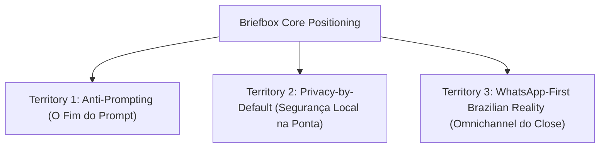

# Briefbox: Brand Strategy & Multi-Channel Content Engine

This document outlines the zero-fluff, tactical brand strategy and multi-channel content engine for Briefbox. Briefbox is a client-side Chrome extension designed to solve context-switching fatigue and lead abandonment for inside sales professionals (SDRs and AEs) by passively stitching multi-channel conversation threads into a unified local context.

---

## PHASE 1: BRAND GUIDELINES & POSITIONING TERRITORY

### 1. Core Value Proposition
Briefbox is a lightweight, local client-side DOM parsing assistant that unifies disjointed messaging threads (Gmail, Outlook, WhatsApp Web, LinkedIn) into a single, unified local context. It operates passively within the user's active browser session to organize messages by priority and generate real-time, context-aware follow-up drafts. It reverses lead abandonment without requiring manual data entry, external prompt engineering, or central dashboards.

### 2. Verbal & Visual Tone Constraints
*   **Minimalist & Non-Intrusive**: No complex dashboards, no workspace clutter. The brand communicates through a clean, native sidebar integration that respects screen real estate and attention.
*   **High-Fidelity & Rep-Centric**: Language must speak directly to the daily operational pain of Sales Development Representatives (SDRs) and Account Executives (AEs) who manage high-volume pipelines. Avoid generic high-level corporate fluff.
*   **Technical & Secure**: Tone must satisfy the security scrutiny of Enterprise IT and procurement officers by emphasizing local execution, client-side safety, and data sovereignty.
*   **Brazilian Inside Sales Relevance**: Communication must naturally incorporate Brazilian sales terminology to build trust with local commercial teams. Key terms to integrate:
    *   **Vendas complexas** (Complex B2B sales cycles requiring deep context retention)
    *   **Leads frios / Leads quentes** (Inactive vs. active prospects in the pipeline)
    *   **Funil de vendas** (The structured stages of sales progression)
    *   **Prospecção ativa** (Outbound outreach and discovery actions)
    *   **Abordagem** (Initial touchpoint and messaging strategy)
    *   **Cadência de prospecção** (Sequence of touchpoints across channels)
    *   **Follow-up** (Actionable contact points to move deals forward)
    *   **Reunião de agendamento/qualificação** (Discovery/qualification calls booked by SDRs)
    *   **Taxa de conversão** (Conversion rates at different funnel stages)

### 3. Strategic Territories

#### Territory 1: Anti-Prompting (O Fim do Engenheiro de Prompt)
*   **Concept**: Busy sales reps do not have time to copy-paste data, build prompts, or manage AI configurations. Briefbox operates with *zero prompting* and *zero friction*. It reads the DOM of active tabs passively and delivers the contextual answer directly where the rep already is.
*   **Key Narrative**: AI is only useful if it doesn't add to the representative's task list. Traditional generative AI tools require the rep to initiate, prompt, and guide. Briefbox reverses this flow by passively extracting context and suggesting follow-up drafts.

#### Territory 2: Privacy-by-Default / IT Procurement (Segurança Local na Ponta)
*   **Concept**: Enterprise IT departments routinely block Chrome extensions due to server-side scraping and data security risks. Briefbox operates strictly inside the user's active, authenticated browser session (local DOM parsing), keeping sensitive pipeline details within the client-side environment.
*   **Key Narrative**: Security compliance is not a barrier to sales enablement. By avoiding central databases and cloud scraping, Briefbox is company-ready from day one, offering pre-configured `.reg` files and ADMX templates for automated deployment.

#### Territory 3: WhatsApp-First Brazilian Reality (O Omnichannel do Close)
*   **Concept**: In Brazil, *vendas complexas* are initiated in Gmail or Outlook but negotiated and closed inside WhatsApp Web. This cross-channel fragmentation leads to broken communication and premature lead abandonment.
*   **Key Narrative**: If a deal isn't tracked across WhatsApp and email, it doesn't exist. Briefbox acts as the lightweight contextual bridge that ties these threads together locally, ensuring that a WhatsApp chat is instantly mapped to the historical context of a proposal sent via email.

---

## PHASE 2: CONTENT DIRECTION & MEDIUM SELECTION

For each strategic territory, the content engine is optimized to minimize audience consumption friction while maximizing algorithmic distribution efficiency.

### Territory 1: Anti-Prompting (O Fim do Prompt)
*   **Video (Short-form)**: High-contrast, rapid screen-recordings highlighting the speed of context retrieval. Showing the immediate slide-in of the Briefbox sidebar generating a follow-up draft in real-time as soon as a chaotic chat page is loaded.
*   **Written (Social)**: Text-based LinkedIn posts detailing the cognitive cost of context-switching and why sales reps resist tools that require manual data inputs or prompt engineering.
*   **Email**: Onboarding tutorials focusing on "Zero-Setup Value"—showing users how the extension automatically starts working on their active Gmail/Outlook/WhatsApp Web tabs without configuration.

### Territory 2: Privacy-by-Default (Segurança Local na Ponta)
*   **Video (Long-form)**: Technical walkthroughs inspecting the network tab to prove that raw customer data does not leave the local browser environment. Demonstrations of automated ADMX package deployment for IT administrators.
*   **Written (Articles)**: Detailed LinkedIn articles and technical blogs written for CIOs, CISOs, and Heads of Sales Operations explaining the architecture of Local DOM Parsing vs. cloud-syncing extensions.
*   **Email**: Enterprise nurture sequences delivering security whitepapers, compliance sheets, and ready-to-run installation guides directly to enterprise decision-makers.

### Territory 3: WhatsApp-First Brazilian Reality (O Omnichannel do Close)
*   **Video (Short-form)**: Storytelling-focused vertical videos highlighting the classic SDR/AE struggle of jumping between Outlook, WhatsApp Web, and LinkedIn to find what a client last agreed to.
*   **Written (Social)**: Highly relatable Brazilian sales content analyzing the statistics of lead abandonment in B2B. Discussion on how the lack of cross-channel historical view impacts the *taxa de conversão*.
*   **Email**: Weekly digest emails containing conversion optimization templates, structured follow-up cadences, and local sales process frameworks.

---

## PHASE 3: OPERATIONAL CHRONOGRAM & DEPLOYMENT

### 7-Day Content Chronogram Skeleton

| Day | Channel | Medium | Conceptual Pillar | Core Message Focus | Hook/Angle Type |
|---|---|---|---|---|---|
| **Day 1** | LinkedIn / Instagram | Short-form Video | Territory 1: Anti-Prompting | Passive DOM parsing vs. manual prompting | Pattern Interrupt (Problem-Solution) |
| **Day 2** | LinkedIn / X (Twitter) | Written (Social Post) | PLG Value Realization | Free tier limits & Pro upgrade triggers | Value-First / Accessibility |
| **Day 3** | LinkedIn | Written (Text Article) | Territory 3: WhatsApp-First | WhatsApp to email fragmentation in Brazil | Cultural Reality (Analytical) |
| **Day 4** | LinkedIn / Tech Blog | Written (Technical Post) | Territory 2: Privacy-by-Default | De-risking local browser DOM for IT | Authority / Security Validation |
| **Day 5** | LinkedIn | Written (Comparison) | Territory 1: Anti-Prompting | Competitive differences: Gemini vs. Claude | Competitive Positioning / Clarity |
| **Day 6** | Email (Product Nurture) | Email Newsletter | PLG Value Realization | Moving from free limits to Pro Tier workflows | Performance Upgrade / Scarcity |
| **Day 7** | LinkedIn | Written (Case Study style) | Territory 2 & Team Tiers | Team templates, custom prompts & ADMX deployment | Enterprise Scalability |

---

### Specific Deployment Directives & Copy Drafts (Day 1 - Day 7)

#### Day 1: Play 1 - The "Anti-Prompting" Video Campaign
*   **Visual Flow**:
    *   **0:00 - 0:03**: Split screen. Left side shows a frustrated SDR copying a massive WhatsApp text, opening ChatGPT, typing a prompt like *"responda essa mensagem propondo..."*, and getting a generic response. Right side shows an SDR loading a WhatsApp conversation, the Briefbox sidebar automatically sliding open, showing the last Outlook email sent, and presenting a pre-drafted follow-up email.
    *   **0:03 - 0:10**: Zoom-in on the Briefbox sidebar highlighting: *“Última proposta enviada por e-mail: R$ 15.000 (Aguardando retorno)”* and a button labeled *“Gerar rascunho de follow-up”*.
    *   **0:10 - 0:15**: Briefbox logo appears over a clean, minimalist browser background with the tagline: *"Sem dashboards. Sem prompts. Contexto puro."*
*   **Copywriting Draft (PT-BR)**:
    > "Você foi contratado para vender ou para treinar inteligência artificial?
    >
    > Se você passa o dia copiando conversas do WhatsApp Web, colando no ChatGPT e escrevendo prompts gigantes para tentar conseguir um e-mail de acompanhamento aceitável, você está perdendo tempo e vendas.
    >
    > O Briefbox resolve isso de forma passiva. Ele lê suas abas ativas localmente, cruza o histórico do Gmail/Outlook com o WhatsApp e gera a resposta ideal no exato momento em que você abre a aba. Sem preenchimento manual, sem dashboards extras e sem perda de contexto no seu funil de vendas.
    >
    > Comece grátis hoje mesmo com até 5 unificações automáticas de thread por dia."

---

#### Day 2: PLG Tier Value Realization
*   **Visual Asset**: High-contrast graphic showing the three tiers (Free, Pro, Team/Enterprise) with clear feature gates.
*   **Copywriting Draft (PT-BR)**:
    > "O maior inimigo da sua cadência de prospecção é o atrito. Por isso, desenhamos a precificação do Briefbox para se pagar no primeiro lead recuperado:
    >
    > 🆓 **Plano Free**: Até 5 unificações automáticas de threads por dia. Ideal para quem está testando o fluxo local e precisa organizar as abas principais de Gmail, Outlook e WhatsApp Web.
    >
    > ⚡ **Plano Pro ($19/mês faturado anualmente)**: Unificações em background ilimitadas, painéis de contexto multi-aplicativo ativos e rascunhos de follow-up automáticos em tempo real. Feito para AEs e SDRs que operam pipelines com mais de 30 leads ativos.
    >
    > 🏢 **Plano Team/Enterprise ($49/seat/mês)**: Modelos de follow-up compartilhados para todo o time, regras locais de prompt personalizadas e pacotes de implantação corporativa (.reg e ADMX) para a TI.
    >
    > Pare de perder leads frios por falta de histórico. Instale o Briefbox e ganhe agilidade no seu navegador."

---

#### Day 3: WhatsApp-First Brazilian Reality
*   **Visual Asset**: Text-only, high-engagement LinkedIn post formatting.
*   **Copywriting Draft (PT-BR)**:
    > "Por que a taxa de conversão em vendas complexas cai tanto no Brasil?
    >
    > Porque nós temos uma dinâmica comercial única no mundo: o primeiro contato (abordagem) acontece por e-mail, mas a negociação real migra rapidamente para o WhatsApp Web.
    >
    > O problema? O histórico fica fragmentado:
    > 1. O contrato de vendas e a proposta formal estão no Outlook.
    > 2. As objeções e o feedback de preço estão no WhatsApp.
    > 3. O CRM fica desatualizado porque o vendedor não tem tempo de transcrever a conversa.
    >
    > Resultado: 32% dos leads são abandonados prematuramente porque o rep simplesmente perde o contexto ou esquece de fazer o follow-up no timing correto.
    >
    > O Briefbox foi feito para essa realidade. Como uma extensão leve de navegador, ele une as pontas de forma 100% local, mostrando o histórico do e-mail ao lado do chat do WhatsApp. Sem esforço manual, sem quebrar o processo."

---

#### Day 4: Play 2 - Enterprise IT De-Risking
*   **Visual Asset**: High-fidelity architectural mockup illustrating client-side parsing vs. cloud database storage.
*   **Copywriting Draft (PT-BR)**:
    > "Sua equipe comercial quer usar IA para agilizar os follow-ups, mas a equipe de TI bloqueou a extensão de navegador. A culpa não é deles.
    >
    > A maioria das extensões envia dados sensíveis de clientes e propostas comerciais para servidores externos para processamento e treinamento de modelos. Para empresas que lidam com vendas complexas e contratos sob sigilo, isso é um risco inaceitável de segurança e conformidade (LGPD/GDPR).
    >
    > É por isso que projetamos o Briefbox sob o modelo de **Local DOM Parsing**.
    >
    > 🔒 **Processamento Local**: O parsing de dados ocorre inteiramente dentro da sessão do navegador ativo do usuário. Nada de extração massiva ou armazenamento em nuvens externas de terceiros.
    > 🏢 **Deployment Pronto para TI**: Disponibilizamos chaves de registro prontas (.reg) e modelos ADMX para implantação automatizada em larga escala.
    >
    > Produtividade para o comercial, segurança absoluta para a governança corporativa. Baixe nosso material de segurança e apresente ao seu time de TI."

---

#### Day 5: Competitive Differentiators (Briefbox vs. Giants)
*   **Visual Asset**: Comparison table matrix comparing Briefbox, Google Gemini for Workspace, and Claude Cowork.
*   **Copywriting Draft (PT-BR)**:
    > "IA para vendas: Por que ferramentas generalistas falham no dia a dia da operação comercial?
    >
    > Vamos comparar os modelos de assistência de produtividade:
    >
    > 1️⃣ **Google Gemini para Workspace**: Extremamente útil, mas limitado ao ecossistema Google. Ele não consegue cruzar o histórico de um e-mail do Gmail com uma janela ativa do WhatsApp Web ou do Outlook. Além disso, exige que o usuário tome a iniciativa (proativo vs. passivo).
    >
    > 2️⃣ **Claude Cowork**: Excelente para automações pesadas de desktop, mas caro, complexo de configurar e focado em rodar fluxos inteiros de trabalho de forma autônoma. Não possui a leitura leve e em tempo real do DOM do navegador.
    >
    > 3️⃣ **Briefbox**: Uma ponte contextual leve, client-side e focada exclusivamente no navegador. Ele monitora passivamente suas abas comerciais ativas e oferece suporte imediato na tela, reduzindo o custo de transação de cada mensagem de follow-up.
    >
    > Não mude sua rotina. Melhore a velocidade dela."

---

#### Day 6: Pro Tier Conversion Sequence (Email)
*   **Email Subject**: `Seu limite de 5 unificações diárias expirou. Não perca o controle do funil.`
*   **Copywriting Draft (PT-BR)**:
    > "Olá,
    >
    > Hoje, o Briefbox ajudou você a unificar o contexto de 5 oportunidades de vendas diretamente no seu navegador. Você economizou tempo e evitou o desgaste mental de buscar históricos entre e-mail e WhatsApp.
    >
    > Mas e os outros leads que continuam frios na sua fila de hoje?
    >
    > Se você gerencia um funil de vendas complexas ativo, limitar sua visão contextual significa deixar dinheiro na mesa.
    >
    > Assine o **Briefbox Pro** por apenas **$19/mês** (faturamento anual) e remova todos os limites:
    > *   Unificação automática de conversas em background sem limite diário.
    > *   Painéis de contexto ativos integrados em tempo real na tela.
    > *   Rascunhos de e-mail e mensagens de WhatsApp sugeridos instantaneamente.
    >
    > [Quero migrar para o Pro agora]"

---

#### Day 7: Enterprise Scaling & Shared Templates
*   **Visual Asset**: Screenshot of the Team Management panel showing where custom prompts and template repositories are set up.
*   **Copywriting Draft (PT-BR)**:
    > "Escalar vendas complexas exige padronização. Se cada representante escreve um e-mail de acompanhamento usando abordagens diferentes, sua taxa de conversão torna-se imprevisível.
    >
    > Mas forçar o time a preencher o CRM para obter essa padronização destrói a produtividade do time comercial.
    >
    > O **Briefbox Enterprise** resolve isso nos dois lados:
    > *   **Modelos Compartilhados**: Distribua os melhores scripts de follow-up e abordagens direto para o navegador de cada vendedor.
    > *   **Regras Locais de Prompt**: Configure diretrizes de redação específicas da sua marca sem expor dados confidenciais a servidores públicos.
    > *   **Deployment ADMX**: Distribuição centralizada e silenciosa para milhares de máquinas via rede interna.
    >
    > Acelere seu funil de vendas com conformidade e controle. Entre em contato com nossa equipe para agendar uma demonstração corporativa."
